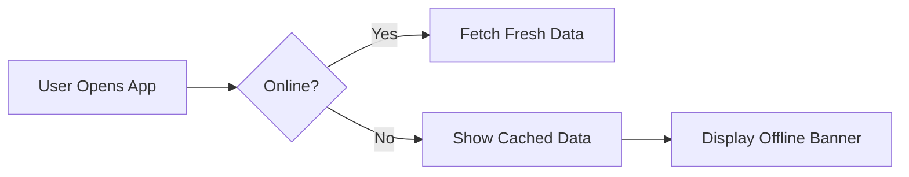
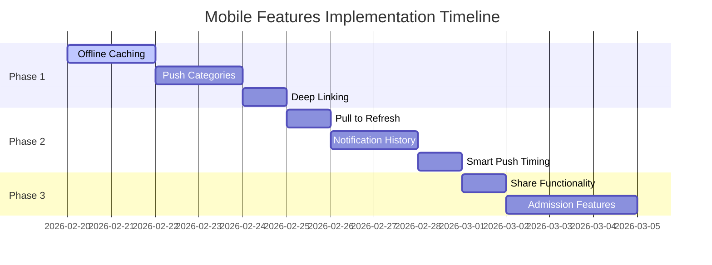

# Mobile Features Plan for GS Hub

## Current State Analysis

Your GS Hub application already has strong mobile foundations:

### ✅ Already Implemented
1. **PWA Support** - Install banner, standalone mode detection, service worker
2. **Push Notifications** - Full infrastructure with VAPID keys, Supabase backend, service worker handling
3. **Mobile-Responsive UI** - Adaptive header, hero, notice cards, search, filters
4. **Offline Support** - localStorage caching for notices (24-hour cache)
5. **Bookmarking System** - Save notices locally, accessible offline
6. **Search & Filtering** - Fuzzy search, category filters with counts
7. **Telegram/WhatsApp Fallback** - For browsers without push support
8. **Auto-Refresh** - Notices refresh every 5 minutes when tab is active

---

## Recommended Mobile Features

### 🔴 High Priority (Recommended First)

#### 1. **Offline Content Caching (Service Worker Enhancement)**
**Problem:** Current service worker only handles push notifications, no asset caching
**Solution:** Add full offline caching for:
- App shell (HTML, CSS, JS bundles)
- Recent notices (last 50 notices)
- Static assets (logos, images)
- PWA manifest for install

#### 2. **Push Notification Categories**
**Problem:** All notices trigger same notification
**Solution:** Allow users to subscribe to specific categories:
- Admission notices only
- Exam/routine updates
- Scholarship updates
- Important announcements only

**Implementation:** Add `category` field to push subscription, modify [`send-notification`](/supabase/functions/send-notification/index.ts) to filter by category

#### 3. **Deep Linking for Notices**
**Problem:** Notifications don't link to specific notice
**Solution:** 
- Modify notification payload to include notice ID
- Add route handler for `/notice/:id`
- Parse URL on app load to scroll to specific notice

---

### 🟡 Medium Priority

#### 4. **Mobile Pull-to-Refresh**
**Problem:** Users must tap refresh button
**Solution:** Add pull-to-refresh gesture on mobile
- Use `react-pull-to-refresh` or custom touch handler
- Trigger notice refetch on pull
- Show loading indicator

#### 5. **Notification History in App**
**Problem:** Users miss notifications if app is closed
**Solution:** Add in-app notification center:
- Store notification history in localStorage
- Show bell icon badge with unread count
- Slide-in panel showing past 30 days of notifications
- Mark as read on tap

#### 6. **Smart Push Timing**
**Problem:** Notifications may come at inconvenient times
**Solution:** 
- Quiet hours setting (e.g., 10 PM - 7 AM)
- Batch notifications (max 1 per hour for same category)
- Weekend awareness (less frequent)

---

### 🟢 Lower Priority / Nice to Have

#### 7. **Share Functionality**
- Native share API (`navigator.share`)
- Share specific notice via WhatsApp/Telegram
- Generate shareable links for admission notices

#### 8. **Admission-Specific Features** (since target is prospective students)
- Countdown widget for admission deadlines
- Admission status tracking
- Document checklist
- Important dates calendar

#### 9. **App Rating Prompt**
- After 5 successful PWA opens, prompt to rate
- Direct to app store/play store if installed

#### 10. **Biometric Authentication (Optional)**
- Face ID / Fingerprint to access saved bookmarks
- Protect sensitive notification settings

---

## Implementation Roadmap

---

## Key Files to Modify

| Feature | Files to Modify |
|---------|-----------------|
| Offline Caching | `public/sw.js`, `vite.config.ts` (PWA plugin) |
| Push Categories | `usePushNotifications.ts`, `send-notification` edge function, DB schema |
| Deep Linking | `App.tsx`, `NoticesSection.tsx`, service worker |
| Pull to Refresh | `NoticesSection.tsx` |
| Notification History | New component, `useNotificationHistory` hook |
| Share | `NoticeCard.tsx` |

---

## Questions for Clarification

1. **Backend Access:** Do you have access to modify the Supabase edge functions?
2. **Database:** Can we add a new table for notification history?
3. **VAPID Keys:** Are your VAPID keys properly configured and working?
4. **Priority:** Which features would you like to implement first?
